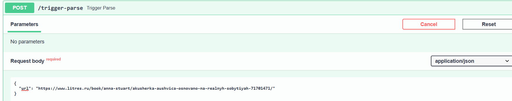
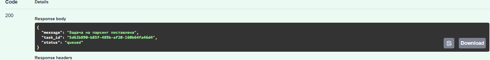
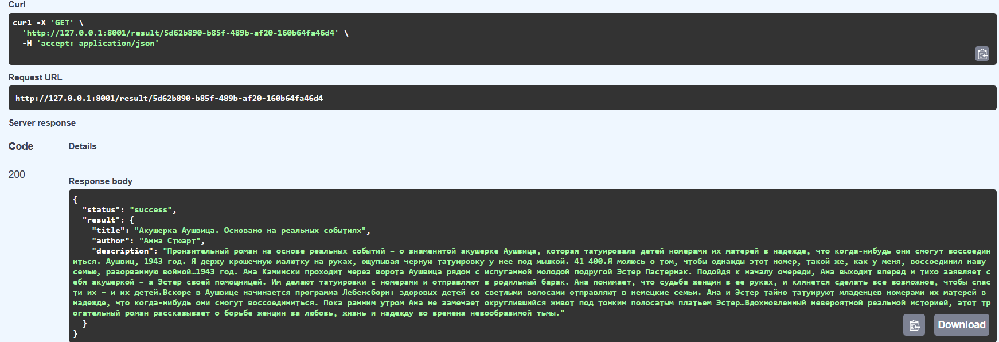

## Вызов парсера из FastAPI
Необходимо добавить в FastAPI приложение ендпоинт, который будет принимать запросы с URL для парсинга от клиента, отправлять запрос парсеру (запущенному в отдельном контейнере) и возвращать ответ с результатом клиенту.

Web-app тригер
```python
@app.post("/trigger-parse")
def trigger_parse(url: str = Body(..., embed=True)):
    parser_url = "http://parser:8000/parse"
    try:
        response = requests.post(parser_url, json={"url": url})
        response.raise_for_status()
        task_info = response.json()
        return {
            "message": "Задача на парсинг поставлена",
            "task_id": task_info["task_id"],
            "status": task_info["status"]
        }
    except requests.RequestException as e:
        raise HTTPException(status_code=500, detail=str(e))
```
## Вызов парсера из FastAPI через очередь

Celery-app

```python
from celery import Celery

celery_app = Celery(
    "parser",
    broker="redis://redis:6379/0",
    backend="redis://redis:6379/0",
    include=["tasks"],
)

celery_app.conf.task_routes = {
    "parser.tasks.parse_url": {"queue": "parsing"},
}
```
tasks
```python
from aiohttp import ClientSession
from bs4 import BeautifulSoup
from celery_app import celery_app
import asyncio


@celery_app.task(queue="parsing", name="parser.tasks.parse_url")
def parse_url(url: str) -> dict:
    async def _fetch_and_parse(u):
        async with ClientSession() as session:
            async with session.get(u, timeout=10) as response:
                if response.status != 200:
                    return {"error": f"Ошибка {response.status}"}
                html = await response.text()
                bs = BeautifulSoup(html, 'html.parser')

                title_tag = bs.find("h1", class_=lambda x: x and x.startswith('BookCard_book__title'))
                if not title_tag:
                    return {"error": "Не найден заголовок книги"}

                parent_divs = bs.find_all('div', class_=lambda x: x and x.startswith('Truncate_truncated'))
                if len(parent_divs) < 2:
                    return {"error": "Не найдены автор или описание"}

                title = title_tag.text.strip()
                author = parent_divs[0].text.strip()
                description = parent_divs[1].text.strip()

                return {
                    "title": title,
                    "author": author,
                    "description": description
                }

    return asyncio.run(_fetch_and_parse(url))
```

## Пример работы
Отправим url

Получаем id задачу

Далее пинганем эндпоинт, чтобы получить статус по таске 
