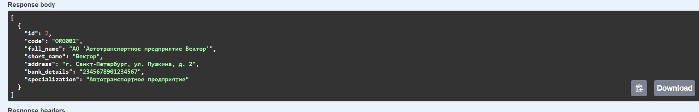
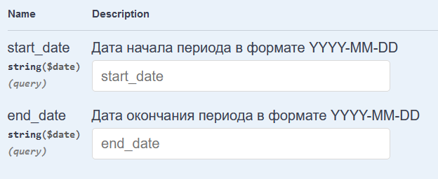
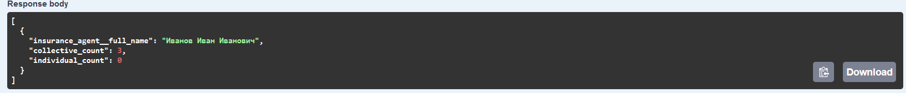
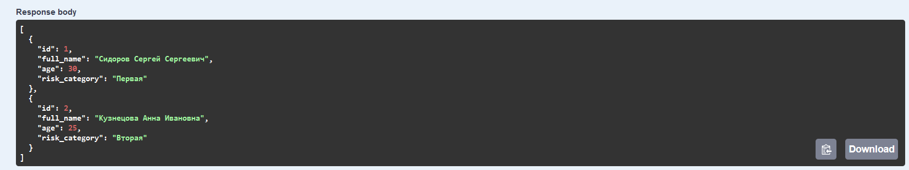
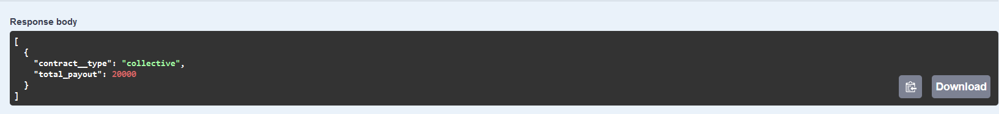
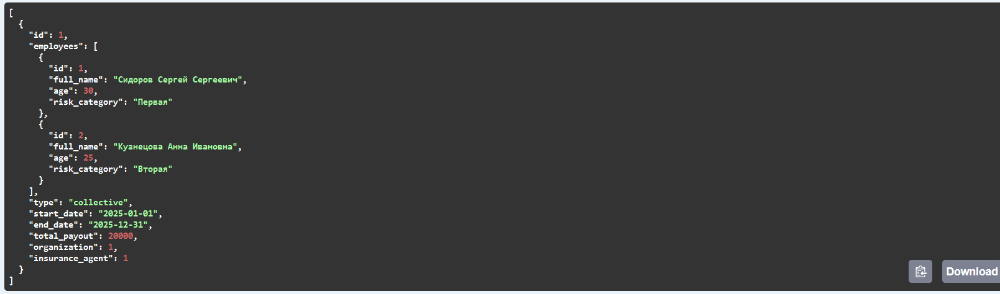

# Реализация серверной части приложения средствами django и djangorestframework в соответствии с заданием из текста работы.
Описание моего варианта
Создать программную систему, предназначенную для управления договорами
страхования с физическими лицами и юридическими организациями.
Страховая организация заключает договоры. Для организации оформляется
коллективный договор, в котором перечислены страхуемые сотрудники: ФИО, возраст,
категория риска (первая, вторая, высшая и т.п.). О предприятии хранится следующая
информация: код, полное наименование, краткое наименование, адрес, банковские
реквизиты (номер банка), специализация предприятия (медицинское учреждение,
автотранспортное предприятие, учебное заведение и т.п.). В заключаемом коллективном
договоре указывается дата заключения, срок договора (начало и конец действия договора),
сумма выплат по каждой категории сотрудников, выплаты по страховым случаям.
Выплаты зависят от категории сотрудника. Необходимо также хранить информацию о
страховом агенте, заключившем договор (ФИО, паспортные данные, контактные данные).
Каждый агент может заключить много договоров, в каждом договоре может быть
оформлено несколько сотрудников. С физическим лицом заключается индивидуальный
договор. Каждый конкретный договор может быть заключен только одним агентом.
При возникновении страхового случая необходима информация о его дате,
причине, решении о выплате страховой суммы и размере выплаты.
Директор компании должен иметь возможность принять и уволить на работу
страхового агента. Поэтому должна сохраняться информация о заключенных с ними
трудовых договорах.
Перечень возможных запросов:


1. Для заданной организации вывести список других организаций,
застрахованных теми же агентами, что и заданная, для действующих
договоров.
2. Для каждого агента вывести количество заключенных им договоров каждого
типа за определенный период времени.
3. Для заданной персоны вывести список застрахованных сотрудников в одном
коллективном договоре для действующих коллективных договоров.
4. Вывести общую сумму выплат по каждому типу договоров при возникших
страховых случаях за заданный период времени.
5. Для каждого юридического лица вывести реквизиты договора и общую сумму
выплат по всем категориям сотрудников.

Стек реализации

    Язык: Python
    фреймворк : Django, DRF

# Документация к сериализаторам

## InsuranceAgentSerializer
Этот класс используется для сериализации модели `InsuranceAgent`. Он преобразует данные модели в формат JSON и обратно.

### Поля:
- `model`: указывает на модель `InsuranceAgent`.
- `fields`: включает все поля модели.

## OrganizationSerializer
Сериализатор для модели `Organization`. Используется для преобразования данных модели в формат JSON и обратно.

### Поля:
- `model`: модель `Organization`.
- `fields`: включает все поля модели.

## EmployeeSerializer
Этот сериализатор отвечает за преобразование данных модели `Employee` в формат JSON и обратно.

### Поля:
- `model`: модель `Employee`.
- `fields`: включает все поля модели.

## CollectiveContractSerializer
Сериализатор для модели `CollectiveContract`. Он используется для преобразования всех данных модели.

### Поля:
- `model`: модель `CollectiveContract`.
- `fields`: включает все поля модели.

## InsuranceCaseSerializer
Сериализатор для работы с моделью `InsuranceCase`. Предназначен для преобразования данных модели.

### Поля:
- `model`: модель `InsuranceCase`.
- `fields`: включает все поля модели.

## EmploymentContractSerializer
Сериализатор для модели `EmploymentContract`. Этот класс включает данные об агенте страхования с использованием вложенного сериализатора.

### Поля:
- `model`: модель `EmploymentContract`.
- `fields`: включает все поля модели.
- `insurance_agent`: сериализатор для агента страхования, только для чтения.
- 
### Документация для `views.py`

#### Класс: `InsuranceAgentViewSet`
Обрабатывает операции CRUD и бизнес-логику для объектов `InsuranceAgent`.

##### Функция: `create`
Создаёт или получает страхового агента на основе паспортных данных и генерирует новый трудовой договор для агента.
```python
    def create(self, request, *args, **kwargs):
        passport_details = request.data.get('passport_details')

        agent, created = InsuranceAgent.objects.get_or_create(passport_details=passport_details, defaults=request.data)

        if created:
            message = 'Создан новый агент.'
        else:
            message = 'Агент уже существует.'

        start_date = now().date()
        end_date = start_date + timedelta(days=365)
        new_contract = EmploymentContract.objects.create(
            insurance_agent=agent,
            start_date=start_date,
            end_date=end_date
        )

        contract_serializer = EmploymentContractSerializer(new_contract)

        return Response({
            'message': f'{message} Создан новый договор.',
            'agent': self.get_serializer(agent).data,
            'contract': contract_serializer.data
        }, status=status.HTTP_201_CREATED if created else status.HTTP_200_OK)
```

---

#### Класс: `OrganizationViewSet`
Обрабатывает операции CRUD и связанные данные для объектов `Organization`.

##### Функция: `related_organizations`
Получает организации, связанные с текущей на основе общих активных договоров.
```python
    @action(detail=True, methods=['get'])
    def related_organizations(self, request, pk=None):
        organization = self.get_object()
        current_date = request.query_params.get('current_date')

        if current_date is None:
            current_date = now().date()

        agent_ids = organization.collectivecontract_set.filter(
            end_date__gte=current_date
        ).values_list('insurance_agent_id', flat=True)

        related_orgs = Organization.objects.filter(
            collectivecontract__insurance_agent_id__in=agent_ids,
            collectivecontract__end_date__gte=current_date
        ).distinct().exclude(id=organization.id)

        serializer = self.get_serializer(related_orgs, many=True)
        return Response(serializer.data)
```

##### Функция: `contract_details_and_payouts`
Получает данные о договорах и их общих выплатах для заданной организации.
```python
    @action(detail=True, methods=['get'])
    def contract_details_and_payouts(self, request, pk=None):
        organization = Organization.objects.get(pk=pk)
        contracts = CollectiveContract.objects.filter(organization=organization)
        serialized_contracts = CollectiveContractSerializer(contracts, many=True).data

        for contract_data, contract in zip(serialized_contracts, contracts):
            total_payout = contract.insurancecase_set.aggregate(total=Sum('payout_amount'))['total'] or 0
            contract_data['total_payout'] = total_payout

        return Response(serialized_contracts)
```

---

#### Класс: `CollectiveContractViewSet`
Управляет объектами `CollectiveContract` и связанными данными.

##### Функция: `agent_contracts_count`
Получает количество договоров (коллективных и индивидуальных) для агентов в указанном диапазоне дат.
```python
    @swagger_auto_schema(
        manual_parameters=[
            openapi.Parameter(
                'start_date',
                openapi.IN_QUERY,
                description="Дата начала периода в формате YYYY-MM-DD",
                type=openapi.TYPE_STRING,
                format=openapi.FORMAT_DATE
            ),
            openapi.Parameter(
                'end_date',
                openapi.IN_QUERY,
                description="Дата окончания периода в формате YYYY-MM-DD",
                type=openapi.TYPE_STRING,
                format=openapi.FORMAT_DATE
            )
        ]
    )
    @action(detail=False, methods=['get'])
    def agent_contracts_count(self, request):
        start_date = request.query_params.get('start_date')
        end_date = request.query_params.get('end_date')

        if not start_date:
            start_date = '1900-01-01'
        if not end_date:
            end_date = '2500-01-01'

        contracts = CollectiveContract.objects.filter(start_date__gte=start_date, end_date__lte=end_date)
        result = contracts.values('insurance_agent__full_name').annotate(
            collective_count=Count('id', filter=Q(organization__isnull=False)),
            individual_count=Count('id', filter=Q(organization__isnull=True))
        )
        return Response(result)
```

##### Функция: `insured_employees`
Получает всех сотрудников, застрахованных по конкретному коллективному договору.
```python
    @action(detail=True, methods=['get'])
    def insured_employees(self, request, pk=None):
        contract = self.get_object()
        employees = contract.employees.all()
        serializer = EmployeeSerializer(employees, many=True)
        return Response(serializer.data)
```

---

#### Класс: `EmployeeCaseViewSet`
Обрабатывает операции CRUD для объектов `Employee`.

---

#### Класс: `InsuranceCaseViewSet`
Управляет объектами `InsuranceCase` и их выплатами.

##### Функция: `total_payouts`
Получает общую сумму выплат, сгруппированных по типу договора, в указанном диапазоне дат.
```python
    @action(detail=False, methods=['get'])
    def total_payouts(self, request):
        start_date = request.query_params.get('start_date')
        end_date = request.query_params.get('end_date')

        if not start_date:
            start_date = '1900-01-01'
        if not end_date:
            end_date = '2100-01-01'

        cases = InsuranceCase.objects.filter(date__gte=start_date, date__lte=end_date)
        result = cases.values('contract__type').annotate(total_payout=Sum('payout_amount'))

        return Response(result)
```


## Djoser

метод POST
создания пользователя 
http://127.0.0.1:8000/auth/users/

Метод POST
Получение токена
http://127.0.0.1:8000/auth/token/login

Метов GET
Получение пользователя по токену
http://127.0.0.1:8000/auth/users/me/

## Аналитические запросы
1 Для заданной организации вывести список других организаций,
застрахованных теми же агентами, что и заданная, для действующих
договоров.

GET /organizations/{id}/related_organizations/

2 Для каждого агента вывести количество заключенных им договоров каждого
типа за определенный период времени.

GET /collective-contracts/agent_contracts_count/



3 Для заданной персоны вывести список застрахованных сотрудников в одном
коллективном договоре для действующих коллективных договоров.
GET /collective-contracts/{id}/insured_employees/

4 Вывести общую сумму выплат по каждому типу договоров при возникших
страховых случаях за заданный период времени.

GET /insurance-cases/total_payouts/


5 Для каждого юридического лица вывести реквизиты договора и общую сумму
выплат по всем категориям сотрудников.
GET /organizations/{id}/contract_details_and_payouts/

