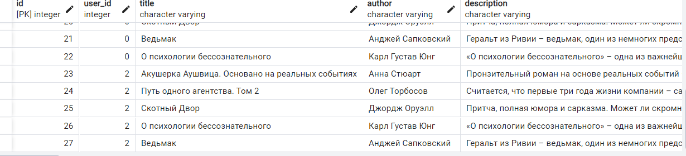

# Задание 2 
*Задача*: Напишите программу на Python для параллельного парсинга нескольких веб-страниц с сохранением данных в базу данных с использованием подходов threading, multiprocessing и async. Каждая программа должна парсить информацию с нескольких веб-сайтов, сохранять их в базу данных.
## Asyncio

```Python
import asyncio
import time

import aiohttp
from bs4 import BeautifulSoup
from aiohttp import ClientSession
from sqlmodel import Session

from api.models.connection import engine
from api.models.models import Book


async def parse_and_save(url, session):
    async with session.get(url, timeout=10) as result:
        if result.status != 200:
            print(f"ошибка {result.status} для {url}")
        html = await result.text()
        bs = BeautifulSoup(html, 'html.parser')
        title = bs.find("h1", class_=lambda x: x and x.startswith('BookCard_book__title')).text
        parent_divs = bs.find_all('div', class_=lambda x: x and x.startswith('Truncate_truncated'))
        author = parent_divs[0].text
        description = parent_divs[1].text

        with Session(engine) as db:
            book = Book(
                    user_id = 0,
                    title=title,
                    author=author,
                    description=description)
            db.add(book)
            db.commit()

async def main(urls):
    async with ClientSession() as session:
        tasks = [parse_and_save(url, session) for url in urls]
        await asyncio.gather(*tasks)


if __name__ == "__main__":
    start = time.time()
    urls = ["https://www.litres.ru/book/karl-ung/o-psihologii-bessoznatelnogo-65745353/",
            "https://www.litres.ru/book/oleg-torbosov/put-odnogo-agentstva-tom-2-71896246/",
            "https://www.litres.ru/book/andzhey-sapkovskiy/vedmak-6375365/",
            "https://www.litres.ru/book/anna-stuart/akusherka-aushvica-osnovano-na-realnyh-sobytiyah-71701471/",
            "https://www.litres.ru/book/dzhordzh-oruell/skotnyy-dvor-8685806/"]
    asyncio.run(main(urls))
    end = time.time()
    print(end-start)

```
## Multiprocessing 
```Python
import asyncio
import time
from multiprocessing import Pool
from bs4 import BeautifulSoup
import requests
from sqlmodel import Session

from api.models.connection import engine
from api.models.models import Book


def parse_and_save(url):
        result = requests.get(url)
        html = result.text
        bs = BeautifulSoup(html, 'html.parser')
        title = bs.find("h1", class_=lambda x: x and x.startswith('BookCard_book__title')).text
        parent_divs = bs.find_all('div', class_=lambda x: x and x.startswith('Truncate_truncated'))
        author = parent_divs[0].text
        description = parent_divs[1].text

        with Session(engine) as db:
            book = Book(
                    user_id = 2,
                    title=title,
                    author=author,
                    description=description)
            db.add(book)
            db.commit()

def main(urls, cpu_count = 4):
    with Pool() as process_pool:
        process_pool.map(parse_and_save, urls)


if __name__ == "__main__":
    urls = ["https://www.litres.ru/book/karl-ung/o-psihologii-bessoznatelnogo-65745353/",
            "https://www.litres.ru/book/oleg-torbosov/put-odnogo-agentstva-tom-2-71896246/",
            "https://www.litres.ru/book/andzhey-sapkovskiy/vedmak-6375365/",
            "https://www.litres.ru/book/anna-stuart/akusherka-aushvica-osnovano-na-realnyh-sobytiyah-71701471/",
            "https://www.litres.ru/book/dzhordzh-oruell/skotnyy-dvor-8685806/"]
    start = time.time()
    main(urls)
    print(time.time()-start)
```
## Threading
```Python
import asyncio
import time
import threading
from bs4 import BeautifulSoup
import requests
from sqlmodel import Session

from api.models.connection import engine
from api.models.models import Book


def parse_and_save(url):
    result = requests.get(url)
    html = result.text
    bs = BeautifulSoup(html, 'html.parser')
    title = bs.find("h1", class_=lambda x: x and x.startswith('BookCard_book__title')).text
    parent_divs = bs.find_all('div', class_=lambda x: x and x.startswith('Truncate_truncated'))
    author = parent_divs[0].text
    description = parent_divs[1].text

    with Session(engine) as db:
        book = Book(
            user_id=2,
            title=title,
            author=author,
            description=description)
        db.add(book)
        db.commit()


if __name__ == "__main__":
    urls = ["https://www.litres.ru/book/karl-ung/o-psihologii-bessoznatelnogo-65745353/",
            "https://www.litres.ru/book/oleg-torbosov/put-odnogo-agentstva-tom-2-71896246/",
            "https://www.litres.ru/book/andzhey-sapkovskiy/vedmak-6375365/",
            "https://www.litres.ru/book/anna-stuart/akusherka-aushvica-osnovano-na-realnyh-sobytiyah-71701471/",
            "https://www.litres.ru/book/dzhordzh-oruell/skotnyy-dvor-8685806/"]
    start = time.time()
    threads = []
    for url in urls:
        t = threading.Thread(target=parse_and_save, args=(url,))
        t.start()
        threads.append(t)

    for t in threads:
        t.join()
    print(time.time() - start)
```
## Время 
Asyncio: 1.61  
Multiprocessing: 3.55  
Threading: 1.08 
## Скрин с БД
